# REAL_TIME_DETECTION
# A Major Project Synopsis on
Real-time Detection Of Poaching In Wildlife Reserves With Thermal Imaging And CNN Using IoT And ML

# INTRODUCTION 
Poaching has become a major issue, particularly in India, where it threatens wildlife like tigers, rhinos, and elephants. The Covid-19 lockdown worsened the problem, doubling poaching incidents. Despite a ban on the ivory trade, elephants continue to be targeted, leading to skewed gender ratios due to poaching of male elephants for their tusks. To combat this, park rangers use limited resources for patrols, but complete coverage is impossible. Recent advancements in thermal imaging and computer vision offer solutions, with deep learning techniques enhancing the detection of animals and humans. A proposed methodology integrates drones, thermal imaging, and Convolutional Neural Networks to improve surveillance and classification in conservation efforts.

# OBJECTIVES
1) The objective of this project is to develop an efficient and cost-effective real-time system to counter poaching, save and protect wildlife.

2) The goal is to use the Internet of Things, drones, and machine learning to detect poachers.

3) Recent research has focused on computer vision and automated animal and human identification to assist overcome this challenge.

# FEASIBILITY STUDY
A machine learning technique that incorporates drones, thermal cameras, and Convolutional Neural Networks. 
Thermal imaging has emerged as a novel technology capable of resolving a wide range of issues. 
Li-On battery will power the drone, which can be charged manually or using solar panels and charging modules.
Real-time video streams are evaluated and classified using a convolutional neural network model specially created.
The live-feed and geographic coordinates of these cameras are relayed to the central hub, allowing the poacher's approximate location to be tracked quickly.

# SYSTEM REQUIREMENTS
The software components LabelImg, Raspberry Pi and Python Libraries, TensorFlow Libraries, Image dataset required are freely available as open-source resources on the internet and does not amount to any costs.

# METHODOLOGY
# 1) CONSTRUCTION:
The proposed system uses the Internet of Things for Data collection and transmission and Convolutional neural networks using machine learning and deep learning for the Data analysis and classification.
The collection of data is performed by an autonomous drone system. It is controlled using a raspberry pi 3 model B+ module acting as the microcontroller and the flight controller. 
The chassis is constructed based on a quadcopter design. It uses 4 brushless dc motors (DJI 2212) with propellors to propel the system into the air. Furthermore, the drone uses an electronic speed controller to adjust the motor speed and a gyroscope (MPU-6050) to adjust the quad’s orientation, acceleration and velocity. 
The drone will be powered using a Li-On battery which may be charged manually or by using Solar panels coupled with Li-On charging modules.
A GPS module (Ublox Neo 6M) will be used to guide the drone throughout different geolocations in the wildlife reserve, where each pair of geographical coordinates will be pre-programmed on the microcontroller. 
A magnetometer (HMC588L) will help the drone to adjust and identify its current orientation and direction. 
The collection of thermal or normal video feed of the wildlife reserve in real-time is performed using an Infrared camera unit (OV5647 5 MP IR-cut camera) attached to the drone. The camera activates thermal vision during the night and normal vision during the day. 
A light intensity sensor (LM393) is used to detect the intensity of light throughout the day and adjust the camera vision. If the light intensity is low, the thermal imaging vision is activated and when the light intensity is high, the normal imaging vision is activated.

Block diagram of Autonomous GPS Drone system.

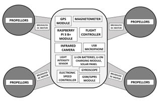

# 2) WORKING:
The real-time video feed is analyzed and classified using a convolutional neural network model. This model is pre-trained on a large dataset containing images of humans and animals in thermal vision and normal vision.
The preconfigured SSD mobile net v2 CNN model is trained using python scripts and TensorFlow object detection libraries. The collected image dataset is first labelled using LabelImg tool in order to create a supervised learning environment.
The drone’s collected data is transmitted via the Wi-Fi network connection established between the central computer system at the main hub and the drone’s raspberry pi unit. 
Once the data is obtained on the central computer, a CNN model will be run on the real-time live feed to classify the objects seen on video. If the model classifies an object as a human, it further classifies the object as a poacher or a forest ranger based on the image details. 
Forest rangers will be provided with specially crafted IR reflective jackets which reflect a unique pattern on camera. The model will also count the number of humans and vehicles present in the reserve, to analyze whether there is an extra number of vehicles or individuals.
If any abnormalities are detected during these analyses, the chief forest rangers are alerted regarding it along with geographic coordinates of the location via security alarms or message-based systems like SMS.

Working of the CNN models

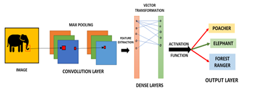

Working of the ANN models.

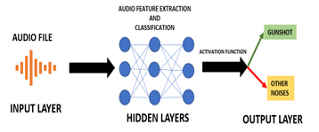

# MODULES IDENTIFIED
The drone will be fueled by a Li-On battery that can be manually charged or charged using solar panels and charging modules.
The drone will be guided by a GPS module (Ublox Neo 6M) across several geolocations in the wildlife reserve, with each pair of geographical coordinates pre-programmed on the microcontroller.
The drone will use a magnetometer (HMC588L) to modify and determine its current orientation and direction.
A convolutional neural network model is used to evaluate and classify real-time video feeds. The model will count the number of people, animals and vehicles in the reserve to see if there are any additional vehicles or people.
The CNN model is trained using python scripts and TensorFlow object detection libraries.
The Preconfigured SSD mobile net v2 model is then trained with the training dataset using TensorFlow and python codes and the accuracy is adjusted by observing the loss rate with respect to epochs.

Detection of Gunshots from recorded live audio feed

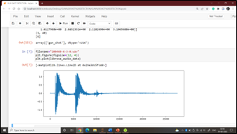

Labelling of dataset images using LabelImg tool

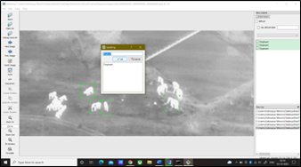

# CONCLUSION
The system that combines two disciplines of computing: the Internet of Things and Machine Learning's Convolutional Neural Networks.
Thermal imaging has emerged as a novel technology capable of resolving a wide range of issues. Poaching is one such issue that affects the biodiversity and ecosystem of our planet.
Real-time video streams from the drone system are evaluated and classified using a convolutional neural network model. Forest rangers will be issued specially developed IR reflective jackets that will reflect a distinctive pattern on camera that is uniquely identified by the CNN model from poachers

# OUTPUTS

Detection and Classification of forest ranger and poacher using Daytime CNN model.

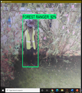

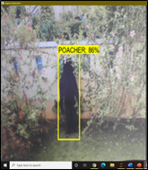

Detection and Classification of Elephants using Daytime CNN model.

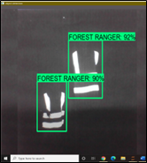

Detection and Classification of forest rangers and poachers using Night-time CNN model

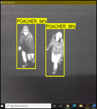

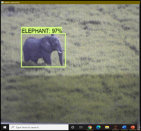

Detection and Classification of Elephants using Night-time CNN model

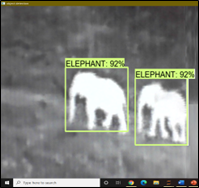
